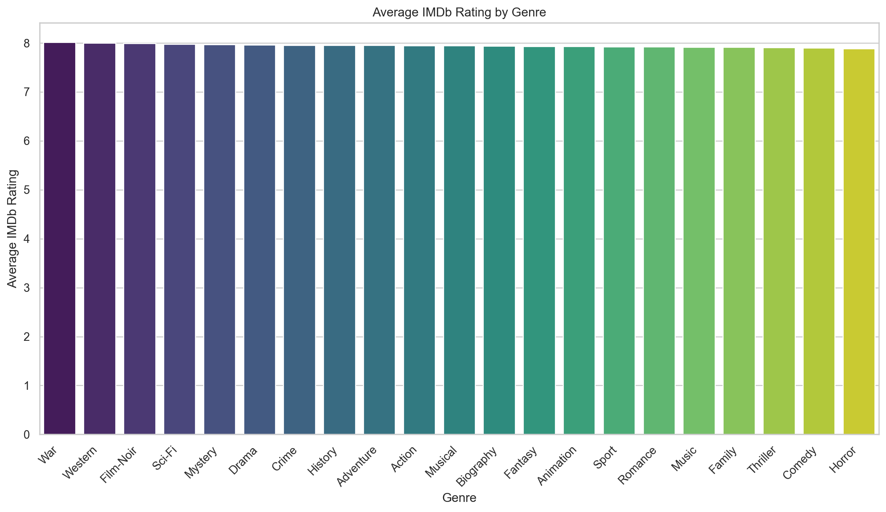
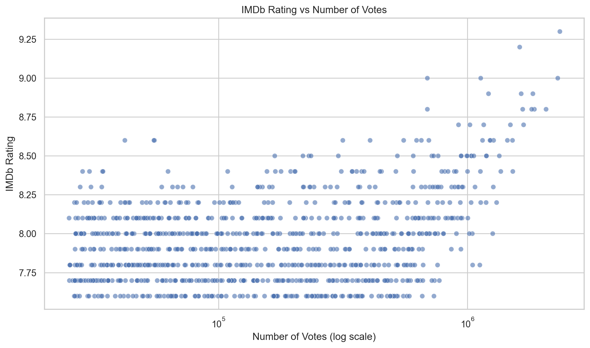
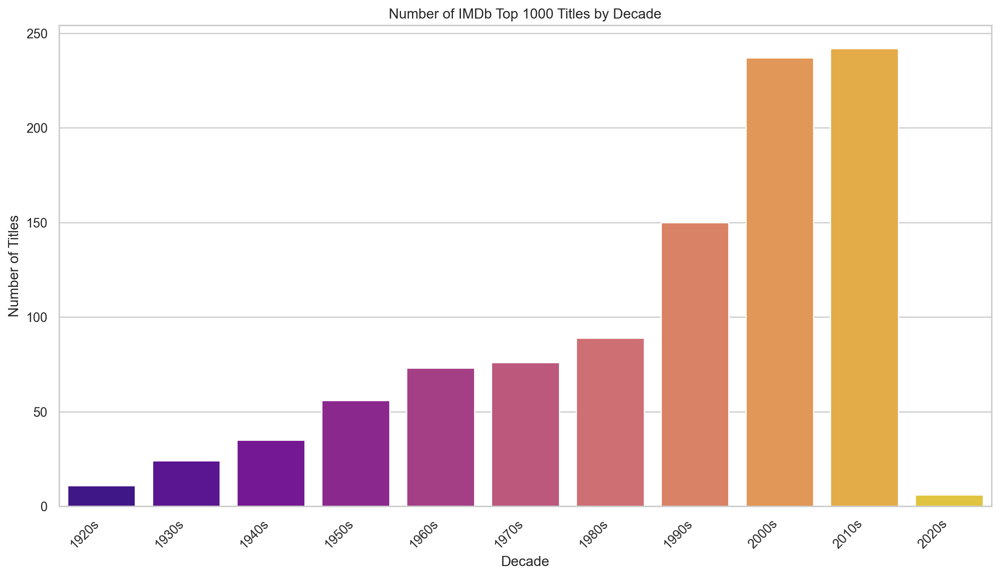

# IMDb Top 1000 Movies Data Analysis

An exploratory data analysis project built around a public IMDb Top 1000 dataset. The purpose is to demonstrate a typical data analysis workflow, from asking questions to cleaning data, creating visualizations, and interpreting the results.

## Project Overview

This project investigates three hypotheses about titles in the IMDb Top 1000 dataset:

1. Do titles tagged with **Drama** have a higher average IMDb rating than the rest of the dataset?
2. Is there a positive relationship between **number of votes** and **IMDb rating**?
3. Are films from the **1990s** the most represented decade in the Top 1000 list?

These questions let me demonstrate several common exploratory data analysis techniques.

## Skills Demonstrated

- Data loading and cleaning with **pandas**
- Exploratory data analysis and visualization with **matplotlib** and **seaborn**
- Basic inferential statistics with a **Welch t-test**
- Communicating findings, limitations, and uncertainty
- Organizing a project beyond a single notebook using reusable Python code

## Dataset

- **Source:** Kaggle
- **Dataset:** [IMDb Dataset of Top 1000 Movies and TV Shows](https://www.kaggle.com/datasets/harshitshankhdhar/imdb-dataset-of-top-1000-movies-and-tv-shows)
- **Local file:** `data/imdb_top_1000.csv`
- **License:** CC0 1.0 Public Domain Dedication

## Notes

### Did I control for genre overlap?
Partially. Genre averages are calculated after splitting movies into individual genres, because one movie can belong to multiple genres. For the comparison, the notebook also evaluates a **Drama vs non-Drama** split at the title level.

### Did I test statistical significance?
Yes, in a limited way. The project includes a **Welch t-test** for Drama vs non-Drama. This is more informative than comparing averages alone, but it is still a simple statistical test rather than a full model.

### Is IMDb Top 1000 representative of film quality?
No. It is better understood as a list based on user ratings and popularity than a measure of film quality.

## Results Summary

- **Drama average rating:** `7.959`
- **Overall average rating:** `7.949`
- **Votes / rating correlation:** `0.495`
- **Most represented decade:** `2010s` with `242` titles
- **Second most represented decade:** `2000s` with `237` titles
- **1990s representation:** `150` titles

Interpretation:
- Drama titles score **slightly** higher on average, but the effect is small.
- Movies with more votes tend to have higher ratings within this dataset, with a **moderate positive correlation**.
- The data does not support the hypothesis that the 1990s was the most represented decade.

## Figures

The charts are generated automatically by `src/analysis.py` and saved in `reports/figures/`.

> Note: if the images are missing after cloning, run `python src/analysis.py` after installing the dependencies.

### Average IMDb Rating by Genre


### IMDb Rating vs Number of Votes


### Number of Titles by Decade


## Getting Started

### Prerequisites
- Python 3.10+
- pip
- Jupyter Notebook or JupyterLab

### Installation

```bash
git clone https://github.com/MarcusOvergaard/imdb_analysis_project.git
cd imdb_analysis_project
pip install -r requirements.txt
```

### Run the notebook

```bash
jupyter lab
```

Then open `notebooks/Visualize.ipynb`.

### Generate the figures

```bash
python src/analysis.py
```

This generates the charts and prints a short summary in the terminal.

## Limitations

- The dataset is a curated Top 1000 list and is not representative of all films.
- It likely reflects popularity, survivorship, and platform-user bias.
- Genre comparisons are imperfect because titles can belong to multiple genres.
- Correlation between votes and ratings does not imply causation.
- The t-test is a simple statistical test, not a complete modeling strategy.

## Future Improvements

- Analyze genre and release decade together.
- Compare IMDb rating with `Meta_score`, runtime, and gross revenue.
- Add confidence intervals and more detailed statistical reporting.
- Build an interactive dashboard version in Streamlit or Plotly Dash.

## License

This repository is released under **CC0 1.0 Universal**.

Dataset source and license:
- Kaggle: https://www.kaggle.com/datasets/harshitshankhdhar/imdb-dataset-of-top-1000-movies-and-tv-shows
- CC0 1.0: https://creativecommons.org/publicdomain/zero/1.0/
